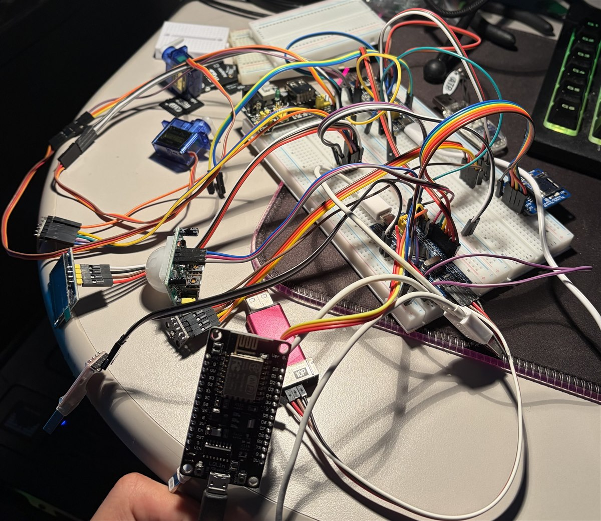
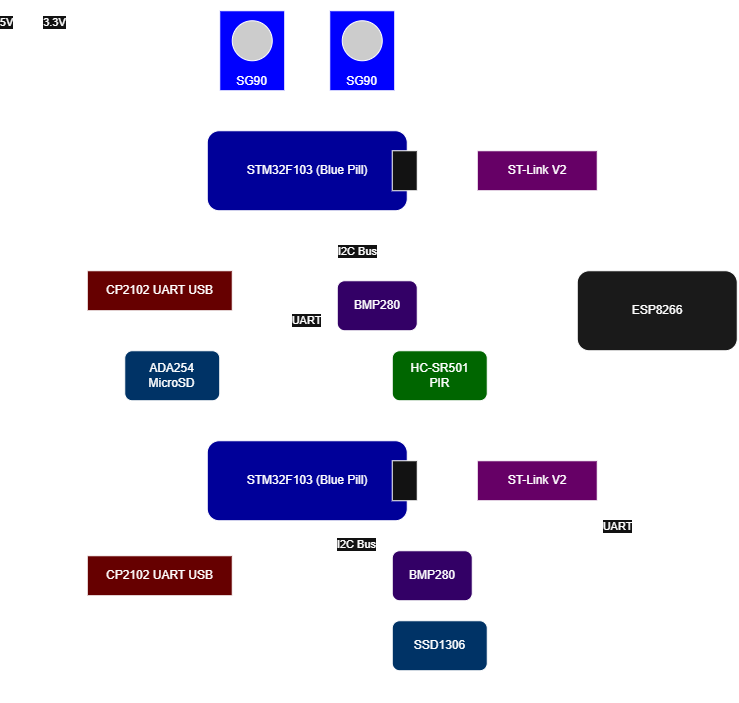

# STM32 Bare-Metal HVAC Ecosystem

  

<p align="center">
  
</p>

Two-node HVAC automation for an attic bedroom that holds heat year-round, where two adjustable ceiling vents are the only physical control. A ceiling node reports duct temperature over a framed UART link. A control node compares it against room temperature, drives the vent servos, logs every decision to microSD, watches the room for occupancy, and streams telemetry to an ESP8266 that serves a live dashboard over WiFi.

Both STM32 nodes are register-level C written against RM0008, with no HAL and no LL. The ESP8266 gateway runs the Arduino framework, because the value there is a working WiFi stack and rewriting one bare-metal would prove nothing.

Validated on the bench, not installed in the room. Mounting is future work.

---

## Features

- Register-level drivers for I2C, SPI, three USARTs, TIM2, EXTI, and clock configuration
- Self-framing wired protocol with checksums, acknowledged commands, and a byte timeout on every receive
- Control law that opens a vent only when the room needs it and the duct air can actually help
- Three USARTs running at once on one F103: debug, inter-node link, WiFi bridge
- SG90 servo control on TIM2 hardware PWM
- SSD1306 OLED showing live room, duct, setpoint and vent state
- FatFS logging to microSD through a custom diskio layer
- PIR occupancy on EXTI with a 24 hour no-motion shutdown
- ESP8266 gateway serving an auto-refreshing dashboard and a JSON endpoint
- Retired nRF24 driver kept in-tree after a two-week postmortem exonerated it

---

## Hardware

<p align="center">
  
</p>

**Control node**, STM32F103C8T6, near the door. Hub, logging, display, gateway bridge.

| Component | Interface | Pins |
|---|---|---|
| BMP280 (room temp) | I2C1 | PB6 (SCL), PB7 (SDA) |
| SSD1306 OLED | I2C1 | PB6 (SCL), PB7 (SDA) |
| MicroSD (ADA254) | SPI1 | PA5 (SCK), PA6 (MISO), PA7 (MOSI), PA4 (CS) |
| HC-SR501 PIR | GPIO + EXTI0 | PB0 |
| Ceiling node link | USART2 | PA2 (TX), PA3 (RX) |
| ESP8266 bridge | USART3 | PB10 (TX), PB11 (RX) |
| CP2102 debug | USART1 | PA9 (TX), PA10 (RX) |

**Ceiling node**, STM32F103C8T6, at the vents. Sensing and actuation.

| Component | Interface | Pins |
|---|---|---|
| BMP280 (duct temp) | I2C1 | PB6 (SCL), PB7 (SDA) |
| SG90 servos x2 | TIM2 CH1/CH2 PWM | PA0, PA1 |
| Control node link | USART2 | PA2 (TX), PA3 (RX) |
| CP2102 debug | USART1 | PA9 (TX), PA10 (RX) |

**Gateway**, ESP8266 NodeMCU (LoLin, FT232R bridge), SoftwareSerial on D5 (RX) and D6 (TX) at 9600 8-N-1.

The two STM32s are wired TX to RX crossed on USART2 with a shared ground. A bathroom node would replicate the ceiling node with one servo and slot into the same topology.

---

## Control Logic

Setpoint 25.56 °C (78.0 °F), deadband 0.85 °C, helping margin 1.10 °C, all compile-time constants. Four states: `CLOSED`, `COOLING`, `HEATING`, `AWAY`.

| Room vs setpoint | Duct vs room | Action |
|---|---|---|
| Above deadband | colder by margin | **open**, cooling |
| Above deadband | not colder | closed, *vents won't help* |
| Below deadband | warmer by margin | **open**, heating |
| Below deadband | not warmer | closed, *vents won't help* |
| Within deadband | any | closed, satisfied |
| no motion for 24 h | any | closed, `AWAY` |

Opening takes two conditions rather than one. A hot room with hot duct air means the furnace is running, so the vent stays shut instead of blowing it in. That case is what the `WON'T HELP` line on the OLED exists to make visible.

Occupancy is a 24 hour shutdown rather than moment-to-moment gating, and the long horizon is what keeps it simple. At ten minutes there is a genuine tension, since closing a vent fights a room you are about to walk back into. Nobody re-enters seconds after a full day away, so closing is clearly right and the question collapses into one override.

---

## How It Works

Both nodes run a 1 Hz loop paced by TIM2. The ceiling node reads duct temperature from its BMP280 over I2C and sends it in a telemetry frame. The control node reads room temperature from its own BMP280, receives that frame, and runs the table above. When the state changes it sends a servo command and waits for the acknowledgement.

Frames are a start byte, a type, a payload and a checksum. Telemetry is fire and forget, commands are acknowledged. Every receive is bounded by a byte timeout instead of blocking forever, so a node whose peer has gone quiet keeps running its own loop. That timeout is the reason three USARTs coexist on the control node without deadlocking.

A servo command carries an angle. The ceiling node turns it into a pulse width on TIM2 channels 1 and 2, sweeping 0.5 ms to 2.5 ms inside a 20 ms period, and both vents move together.

On the control node the SSD1306 shares the I2C bus with the BMP280 and redraws every cycle with room and duct temperature, setpoint, vent state, and the `WON'T HELP` line. The PIR raises an EXTI interrupt that stamps `last_motion` from the timer tick, and if 24 hours pass without one the vents close and the state becomes `AWAY` until motion returns. Every cycle also appends a record to `log.csv` on a microSD card over SPI, written through FatFS on a custom diskio layer. The card driver is SDSC only, so 2 GB is the ceiling.

```
timestamp, temp, tempVent, state, wontHelp, last_motion
```

Temperatures are hundredths of a degree Celsius everywhere in the firmware and get converted only where they are shown. The control node writes one more line per cycle to USART3, where the ESP8266 is listening:

```
T <temp>, <tempVent>, <state>, <setpoint>\n
```

The ESP assembles that byte stream into whole lines, parses each into a struct, and holds the last good reading. `/` serves a self-contained HTML page and `/data` serves the current values as JSON. The page fetches `/data` every two seconds and redraws itself, so the browser drives the refresh and the ESP stays a passive responder. Before the first complete line arrives, `/data` answers 503 instead of serving zeros that would render as a convincing 32.0 °F.

```json
{"room":2891,"duct":2962,"state":0,"set":2556}
```

---

## Quick Start

**Requirements:** STM32CubeIDE, ST-Link V2, Arduino IDE with the ESP8266 board package, a FAT32 microSD card of 2 GB or less, and a WiFi network.

1. Open `hvac_ceiling_node/` and `hvac_control_node/` as separate STM32CubeIDE projects and flash each over SWD.
2. Format the SD card as FAT32 and insert it before powering the control node. The file is opened once at startup.
3. In `hvac_esp_gateway/`, copy `secrets_example.h` to `secrets.h` and fill in your WiFi credentials. It is gitignored and stays on your machine.
4. Flash `hvac_esp_gateway.ino`, open the serial monitor at 115200, and note the IP it prints after joining. Close the monitor before re-flashing, since it holds the COM port.
5. Open that IP in a browser on the same network.

---

## Why Wired: The Wireless Postmortem

The wireless link worked once, on 2026-06-29, with live packets and auto-ack. Then it stopped and never came back.

Two weeks went into finding out why. The driver was audited against the datasheet, diffed against a reference implementation, and bisected by swapping firmware between the two nodes. Register readbacks confirmed every configuration value was landing. Transmit power was swept across its full range, three data rates were tried, and a second module type from a second order, including a pair that had never been powered, failed in exactly the same way. The test that ended it was the simplest one: with a module driving a continuous carrier at full power a metre away, the receiver's carrier-detect bit never read high. Nothing was radiating, and nothing ever had been.

They were SI24R1-class counterfeits whose SPI reads hand back whatever you last wrote while the RF front end does nothing. A flawless protocol engine bolted to dead silicon. The radio was transport rather than the point of the project, so it was replaced with a three-wire UART link, and the firmware went into the new link having already been proven correct. The driver stays in the repo in case real modules ever turn up.

---

## Design Notes

What this project kept teaching is that a measurement usually exists, and it is usually cheaper than the reasoning it would replace. The 1 Hz loop started as a counted busy-wait labelled *one second delay*, and the first timestamp against a real clock measured it at 5.84 seconds. Servo torque at the vent stayed an open question for weeks until a horn went on one and it got tried. The nRF24 investigation only ended when a carrier was actually transmitted and a receiver was actually asked whether it could hear anything. The counterexample matters just as much. Months after the radio was retired the ESP8266 refused to enumerate, and the same method was pointed at it: candidates listed, tests run, board declared dead. The board was fine. Its silkscreen had been read as a CH340G, so every test hunted for a CH340G, and the FT232R sitting on the correct COM port appeared in the notes and got written off as a phantom. The method was rigorous about the candidates it chose and never questioned the assumption that chose them. Discipline downstream of a bad premise only makes the wrong answer arrive with better evidence.

---

## Status

- Phase 0, mechanical validation ✅
- Phase 1, single-node POC: BMP280 and servo PWM ✅
- Phase 2, nRF24 wireless link ✅ (retired, see postmortem)
- Phase 3, wired UART link with framed protocol ✅
- Phase 4, reactive control, OLED, timer paced ✅
- Phase 5, ESP8266 gateway: dashboard and JSON ✅ (2026-08-20)
- Phase 6, occupancy and logging: PIR, 24 h shutdown, FatFS CSV ✅ (2026-08-19)
- Installation, mount in the room and let it run ⬜

Every component in the inventory works. What is left is mechanical. Next are lever-arm fabrication and mounting, a mutable setpoint with a receive path on USART3 so the dashboard can command as well as observe, and a hardware UART to close the corruption noted above. Further out: an NTP-set RTC for wall-clock timestamps, weather forecast input, the bathroom node, and a wireless revival if genuine modules ever turn up.

---

## Repo Structure

```
stm32-hvac-ecosystem/
├── hvac_ceiling_node/     # Ceiling node firmware (STM32F103C8T6)
├── hvac_control_node/     # Control node firmware (STM32F103C8T6)
└── hvac_esp_gateway/      # ESP8266 WiFi gateway (Arduino framework)
```

The two STM32 nodes are independent build targets with no shared source path, so the framing functions live in both on purpose. A shared `frame.c` inside one project does nothing for the other, and one copy in each is the same duplication under a different name. A `common/` directory only earns its place if the shared surface grows past a pair of functions.

Drivers are adapted from [stm32-imu-logger](https://github.com/rohaanbrar-stack/stm32-imu-logger). Each node's `nRF24.c` is the retired wireless driver.

---

## Author

Rohaan Brar — embedded systems learning project, Purdue CompE.
